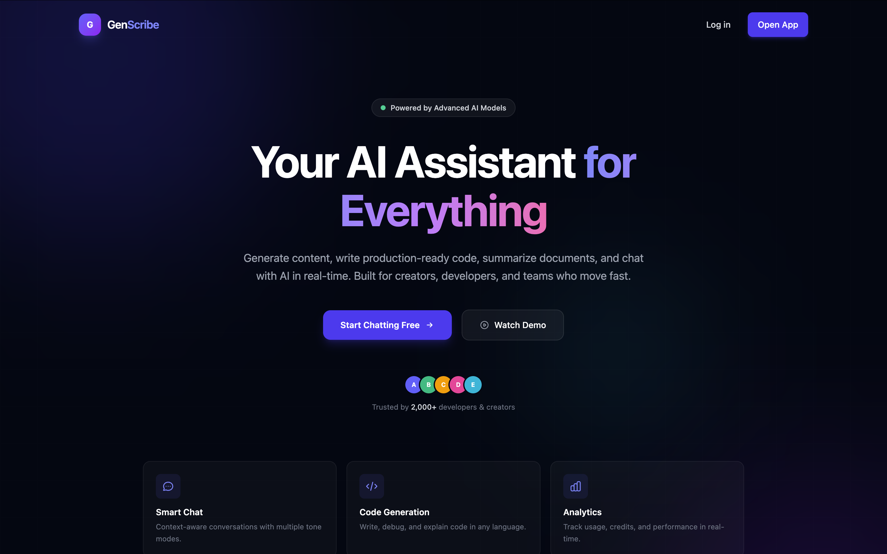
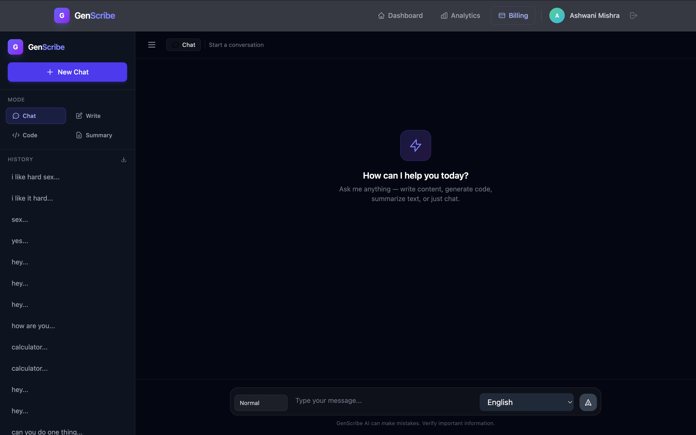
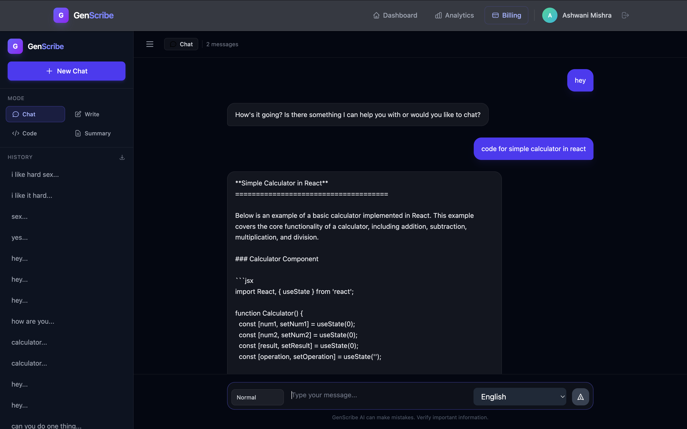
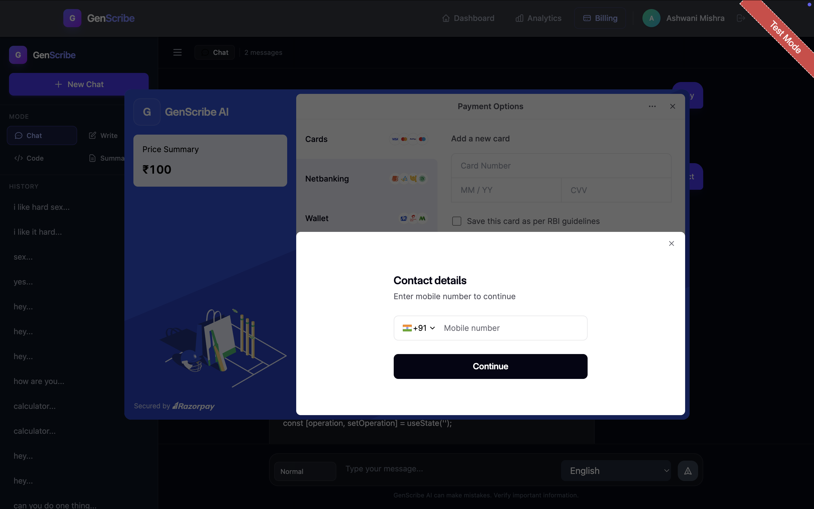
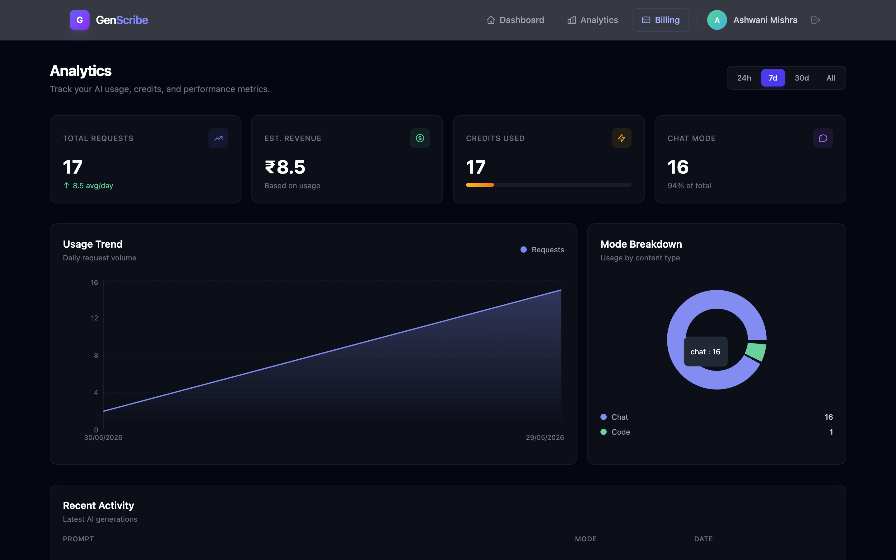
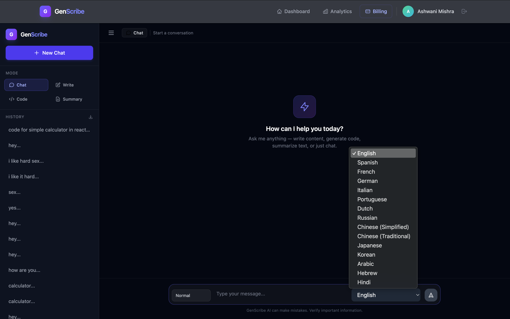
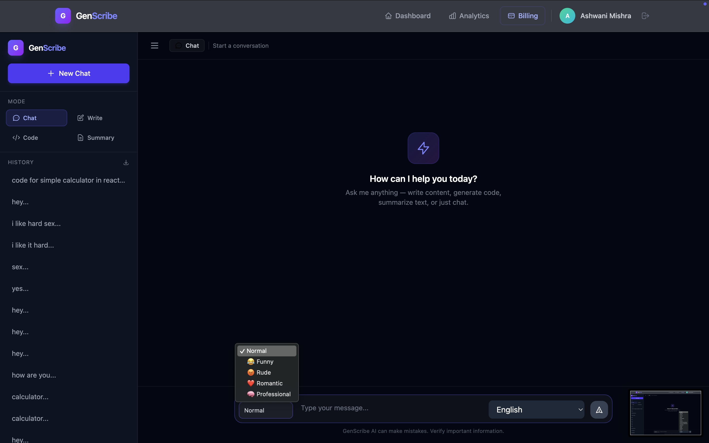

# 🚀 GenScribe AI

GenScribe AI is a full-stack AI SaaS platform built using the MERN stack. It enables users to generate content, chat with AI, summarize text, write code, and customize responses with different tones and languages. The platform includes secure authentication, a credit-based usage system, and Razorpay payment integration.

---

## 🌐 Live Demo

🔗 https://genscribe-one.vercel.app/

---

## 📌 Features

### 🤖 AI-Powered Tools
- AI Chat Assistant
- Content Generation
- Code Generation
- Text Summarization
- Question Answering

### 🎭 Tone Control
Choose from multiple tones:
- Professional
- Funny
- Casual
- Romantic
- Motivational

### 🌍 Language Support
Generate responses in different languages.

### 🔐 Authentication & Security
- JWT Authentication
- User Registration & Login
- Protected Routes

### 💳 Payment Integration
- Razorpay Payment Gateway
- Credit-Based Usage System
- Subscription Support

### 📊 User Dashboard
- Usage Tracking
- Credit Monitoring
- User Analytics

### 📱 Responsive Design
- Mobile Friendly
- Tablet Friendly
- Desktop Optimized

---

## 🛠️ Tech Stack

### Frontend
- React.js
- Bootstrap
- React Router
- Axios

### Backend
- Node.js
- Express.js

### Database
- MongoDB
- Mongoose

### Authentication
- JWT (JSON Web Token)

### AI Integration
- OpenAI API
- Groq API

### Payments
- Razorpay

### Tools
- Git
- GitHub
- Postman
- Vercel
- Render

---

## 📸 Screenshots

### Home Page


### AI Content Generation


### AI Chat Interface


### Payment Integration 


### User Analytics


### Easy Language Selection


### Tone Selection


---

## 🏗️ Project Structure

```bash
GenScribe/
│
├── client/
│   ├── src/
│   ├── public/
│   └── package.json
│
├── server/
│   ├── routes/
│   ├── controllers/
│   ├── middleware/
│   ├── models/
│   └── server.js
│
├── screenshots/
│   ├── screenshot1.png
│   ├── screenshot2.png
│   ├── screenshot3.png
│   ├── screenshot4.png
│   ├── screenshot5.png
│   ├── screenshot6.png
│   └── screenshot7.png
│
└── README.md
```

---

## 🚀 Installation

### Clone Repository

```bash
git clone https://github.com/Ashwani895/Genscribe.git
```

### Navigate to Project

```bash
cd Genscribe
```

### Install Frontend Dependencies

```bash
cd client
npm install
```

### Install Backend Dependencies

```bash
cd ../server
npm install
```

### Configure Environment Variables

Create a `.env` file inside the server directory:

```env
PORT=5001
MONGO_URI=your_mongodb_connection_string
JWT_SECRET=your_secret_key
GROQ_API_KEY=your_groq_api_key
OPENAI_API_KEY=your_openai_api_key
RAZORPAY_KEY_ID=your_key
RAZORPAY_KEY_SECRET=your_secret
```

### Start Backend

```bash
npm start
```

### Start Frontend

```bash
npm run dev
```

---

## 🎯 Key Highlights

✅ Full Stack MERN Architecture

✅ AI Integration (OpenAI & Groq)

✅ JWT Authentication

✅ Razorpay Payment Integration

✅ Credit-Based SaaS Model

✅ Responsive UI Design

✅ Multi-Tone AI Responses

✅ Production-Ready Structure

---

## 🔮 Future Enhancements

- AI Image Generation
- Team Workspaces
- Export to PDF/Word
- Chat History Search
- Advanced Analytics

---

## 👨‍💻 Author

**Ashwani Mishra**

📧 ashwanimishra.dev@gmail.com

🌐 Portfolio: https://portfolio-six-beryl-92.vercel.app/

💼 LinkedIn: https://linkedin.com/in/your-linkedin

🐙 GitHub: https://github.com/Ashwani895

---

⭐ If you like this project, consider giving it a star on GitHub!